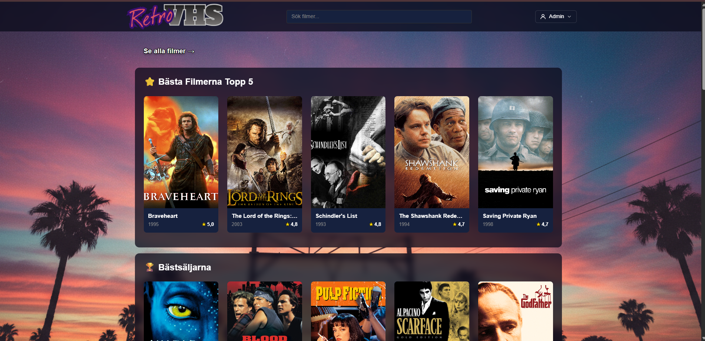
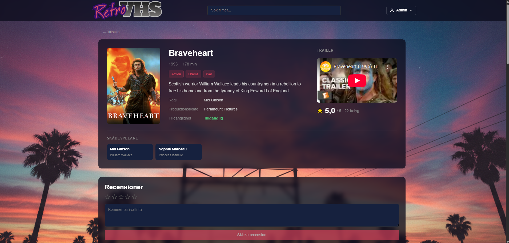
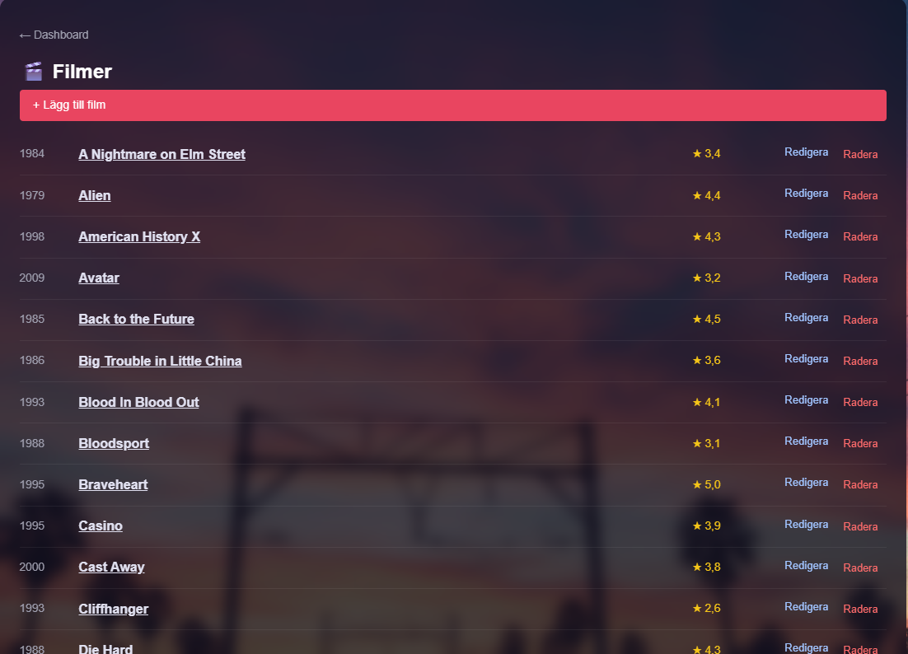
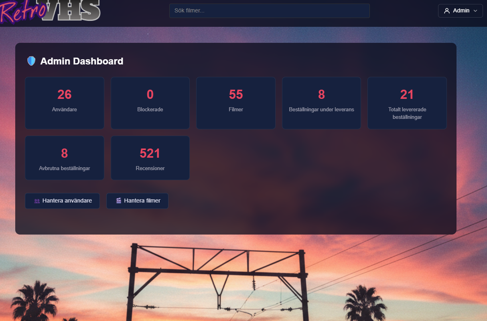
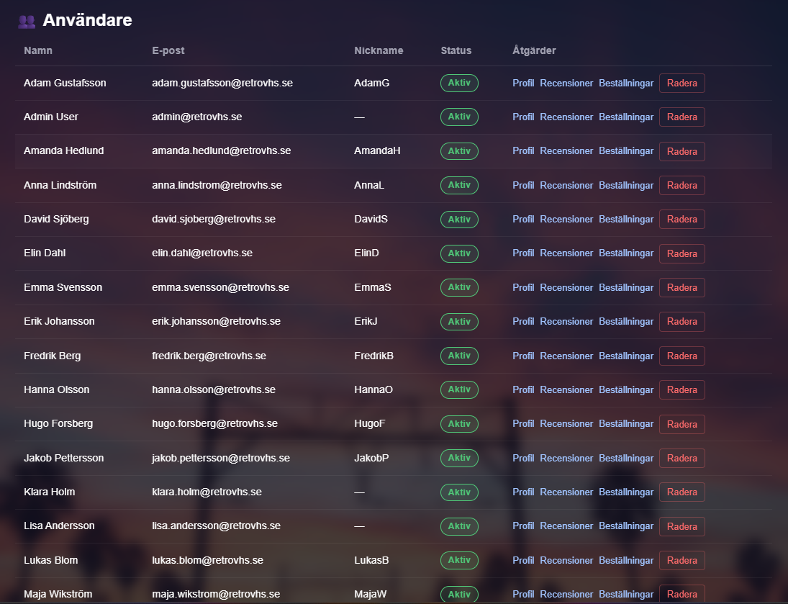
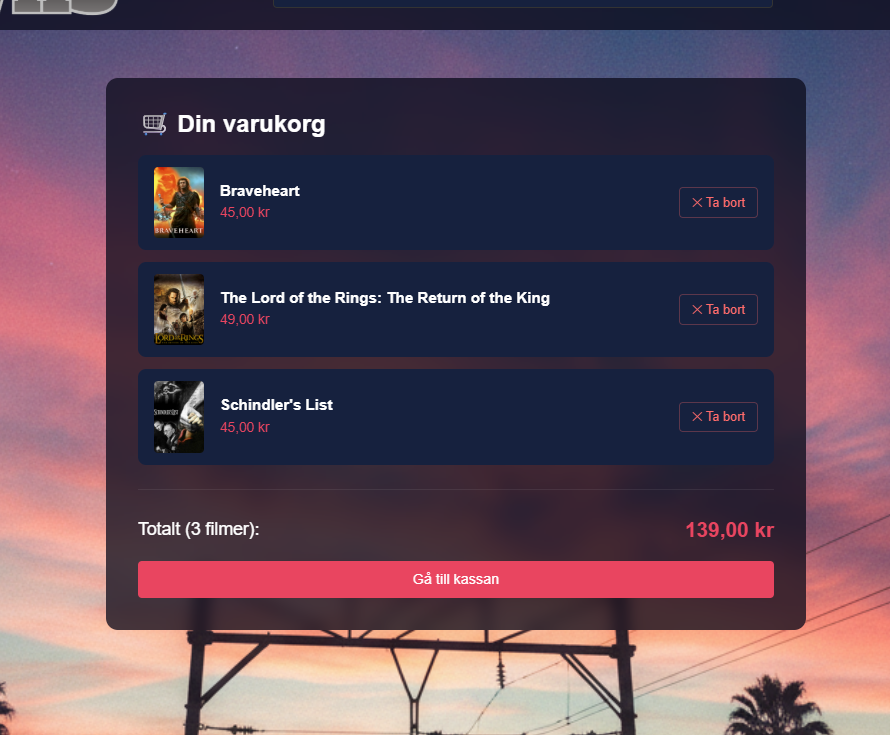

# RetroVHS

> En fullstack VHS-uthyrningsplattform byggd med ASP.NET Core 9 och Blazor Server.


---

## Innehåll

- [Om projektet](#om-projektet)
- [Screenshots](#screenshots)
- [Funktioner](#funktioner)
- [Arkitektur](#arkitektur)
- [Kom igång](#kom-igång)
- [API-dokumentation](#api-dokumentation)
- [Testning](#testning)
- [Demokonton](#demokonton)
- [Teamet](#teamet)

---

## Om projektet

RetroVHS är en webbapplikation för VHS-filmuthyrning med autentisering, filmkatalog, kundvagn, betygsättning och ett fullständigt adminpanel. Projektet är byggt som ett grupparbete i kursen ASP.NET Core + Blazor.

---

## Screenshots


| Startsida | Filmkatalog |
|-----------|-------------|
|  |  |

| Filmdetaljer | Adminpanel |
|--------------|------------|
|  |  |

| Användare | Varukorg |
|-----------|----------|
|  |  |

---

## Funktioner

### Användare
- Registrering och inloggning med JWT + refresh tokens
- Sök, filtrera och sortera filmkatalogen
- Visa filmdetaljer med skådespelare, regissör och recensioner
- Kundvagn och checkout
- Orderhistorik
- Skriv, redigera och ta bort egna recensioner (1–5 stjärnor)
- Önskelista

### Admin
- Dashboard med statistik (användare, ordrar, recensioner)
- Hantera filmer: skapa, redigera, ta bort
- Hantera användare: blockera, avblockera, sätta smeknamn
- Granska och ta bort recensioner
- Köphistorik

---

## Arkitektur

```
RetroVHS.Api/               ASP.NET Core Web API
├── Controllers/            11 REST-controllers
├── Services/               Business logic (Auth, Movies, Cart, Rentals, Reviews, ...)
├── Models/                 13 entiteter (Movie, User, Rental, Review, ...)
├── Data/                   DbContext, migrationer, DbSeeder
└── Auth/                   JWT-tjänster

RetroVHS.Client/            Blazor Server (Interactive Components)
├── Components/Pages/       17 Razor-sidor (inkl. 7 admin-sidor)
├── Components/Layout/      Header, HeaderSearch, AuthButtons, UserMenu
├── Components/             MovieCard, LoadingSpinner, RedirectToLogin
└── Services/               HTTP-klienter (IMovieClient, IAuthClient, ...)

RetroVHS.Shared/            Delade kontrakt
├── DTOs/                   30+ request/response-modeller
└── Enums/                  MovieAvailabilityStatus, RentalStatus, CreditRole, ...

RetroVHS.Tests/             Enhetstester
├── Controllers/            8 controller-testklasser
└── Services/               10+ service-testklasser
```

### Tekniker

| Lager | Tekniker |
|-------|---------|
| Backend | ASP.NET Core 9, Entity Framework Core 9, ASP.NET Identity |
| Frontend | Blazor Server, Razor Components, SignalR |
| Databas | SQLite, EF Core Migrations |
| Auth | JWT Bearer, Refresh Tokens, ProtectedLocalStorage |
| Testning | xUnit, Moq, EF Core In-Memory |
| Dokumentation | Swagger / OpenAPI |

---

## Kom igång

### Förutsättningar

- [.NET 9 SDK](https://dotnet.microsoft.com/download)
- Visual Studio 2022 eller VS Code

### Installation

```bash
# Klona repot
git clone https://github.com/nicolinawegert-cmd/RetroVHS.git
cd RetroVHS

# Återställ beroenden
dotnet restore

# Kör databasmigrationer
dotnet ef database update --project RetroVHS.Api

# Starta API:et
dotnet run --project RetroVHS.Api

# Starta klienten i ett nytt terminalfönster
dotnet run --project RetroVHS.Client
```

Öppna `https://localhost:7220` i webbläsaren.

> Databasen seedas automatiskt med demokonton och exempelfilmer vid första start.

---

## API-dokumentation

Swagger UI är tillgängligt på `https://localhost:7001/swagger` när API:et körs.

---

## Testning

```bash
dotnet test RetroVHS.Tests
```

Projektet har 20+ testklasser som täcker controllers och services med xUnit och Moq.

---

## Demokonton

| Roll | E-post | Lösenord |
|------|--------|----------|
| Admin | admin@retrovhs.se | Admin123! |
| Användare | user@retrovhs.se | User123! |

---

## Teamet

| Namn | Ansvar |
|------|--------|
| Daniel, Nicolina, Charlie | Backend – Auth, API |
| Daniel, Nicolina, Charlie | Backend – Movies, Admin |
| John | Frontend – Blazor UI |
| John | Frontend – Komponenter |
| Jelal, Alex | Tester, Shared DTOs |
| Jelal, Alex | Docs, Integration |

---

_Redovisning: 27 mars 2026_
